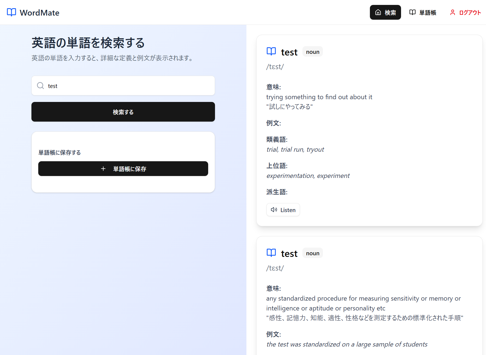
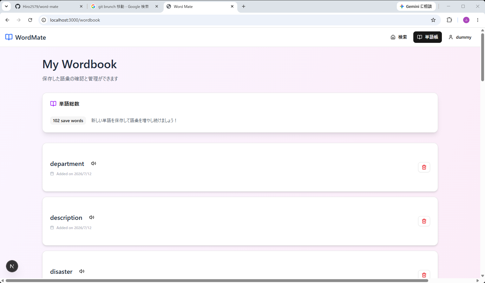
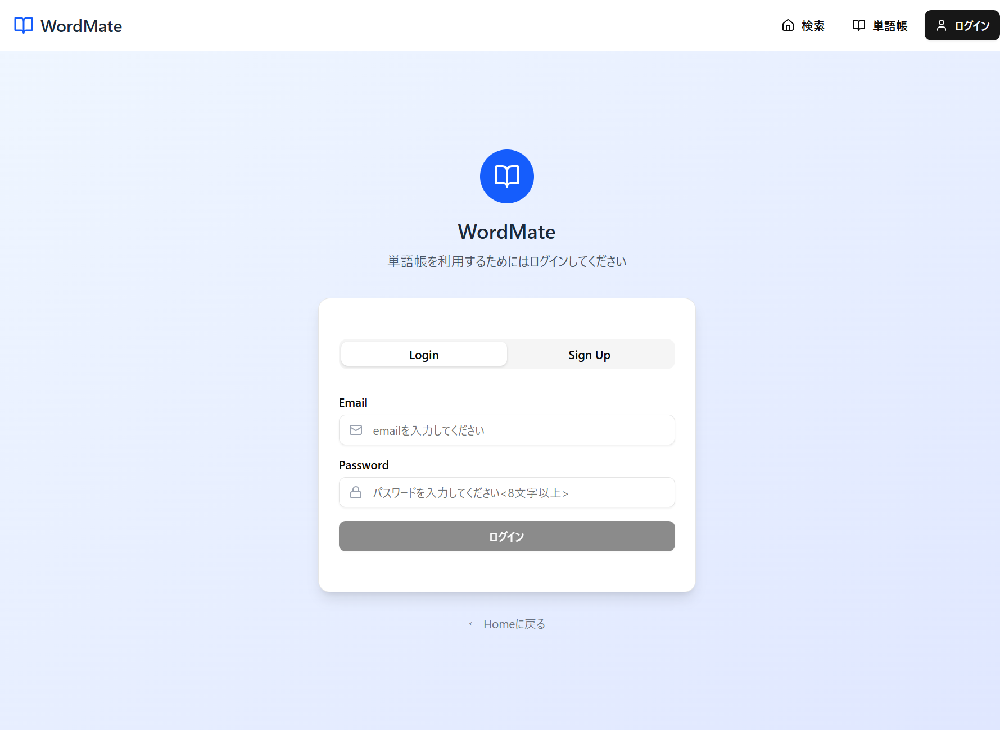

# はじめに

このアプリは個人の学習およびポートフォリオとして作成したプロジェクトです。

# WordMate

https://word-mate-app.vercel.app/

# アプリ概要

- 入力欄に英単語を入力していただくと、英単語の詳細情報を取得できます。
- ログインしていただけると単語帳機能を利用できるようになります。
- 

    
ゲストユーザー用アカウント

    Email: `dummy@gmail.com`, Password: `hogehoge`
  

# アプリ画面一覧

### 🏠 ホーム画面

---

### 📚 単語帳画面

---

### 🔐 ログイン画面

# 使用技術

<table>
  <tr>
    <td>フロントエンド</td> <td>TypeScript, React, Next.js, TailwindCSS</td>
  </tr>
  <tr>
    <td> バックエンド </td> <td>Typescript, Next.js, supabase</td>
  </tr>
  <tr>
    <td> テスト </td> <td>Jest, React Testing Library  </td>
  </tr>
  <tr>
    <td> CI/CD </td> <td>Github Actions  </td>
  </tr>
  <tr>
    <td> ホスティング先 </td> <td>Vercel</td>
  </tr>
  <tr>
    <td> API </td> <td>WordsAPI, DeeplAPI</td>
  </tr>
  <tr>
    <td> その他 </td> <td>shad/cn, v0</td>
  </tr>
</table>
 
# 機能一覧
 
### 🏠 ホーム画面

- WordsAPIを用いた英単語の検索機能
- WordsAPIからデータを取得してブラウザに表示
- DeeplAPIを用いた英語から日本語へ和訳機能
- クッキーにログイン情報を保持しているとデータベースに検索した英単語を保存できるように実装
- モバイルナビゲーション機能（レスポンシブデザイン実装）
- 英単語の読み上げ機能の実装

### 📚 単語帳画面

- クッキーにログイン情報を保持していると単語帳ぺージにアクセスできるように実装
- データベースから英単語を読み取りブラウザに出力
- 英単語の削除機能の実装
- ページネーション

### 🔐 ログイン画面

- ログイン機能の実装
- アカウント作成機能の実装
- ログアウト機能の実装
- パスワード変更機能の実施
- アカウント削除の実施

### その他

- Githubにpushすると自動でテストが走り、全て合格すると自動でVercelにデプロイします。
- 主にコンポーネントが正しく表示されているかのテストをしています。（ユニットテスト）
